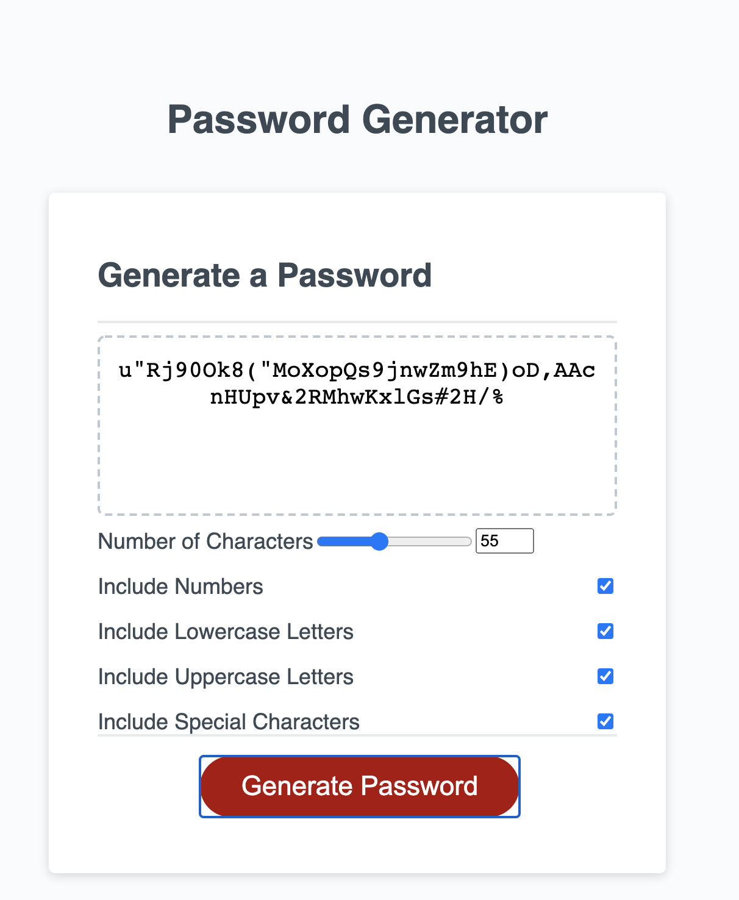

# random-password-generator

##Installation

To use the website simply vist [its page](https://fewb92.github.io/random-password-generator/)

Alternatively, visit the [project repository](https://github.com/fewb92/random-password-generator)

##About This Project

This project is a random password generator which allows for a user to generate a password by modifying certain parameters on the page to influence the resulting password.

The parameters that can be modified are: Include Numbers, Include Lowercase letters, Include Uppercase Letters, Include Symbols as well as a value for the total number of characters in the resulting password. Javascript code works in the background to interpret the user's input and generate a new password. ASCII codes are a key component of the password generation as they are used to generate characters, rather than character arrays. 

Any questions about the project can be directed to [Josh's email](josh@jpix.nyc)